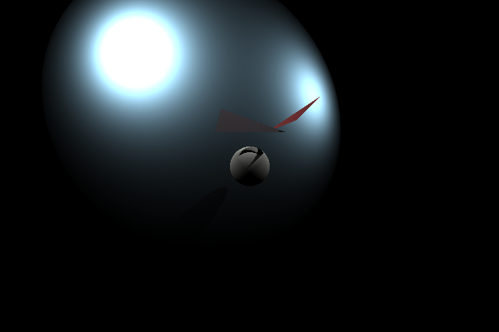
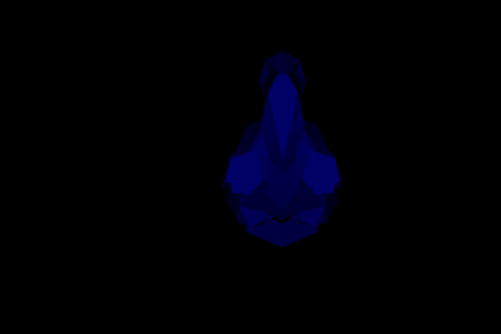
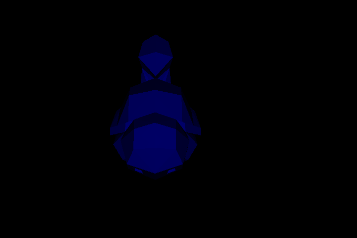
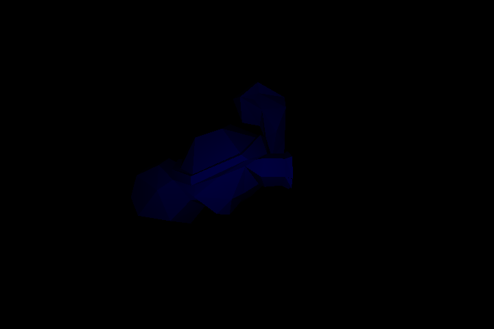
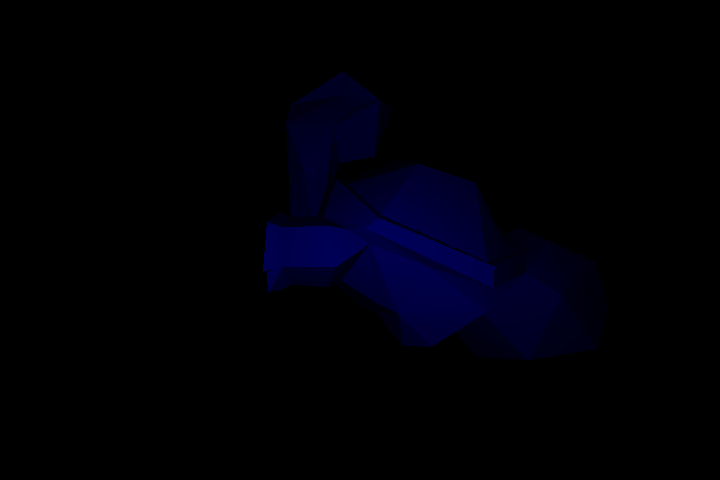
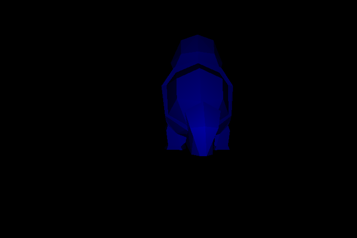
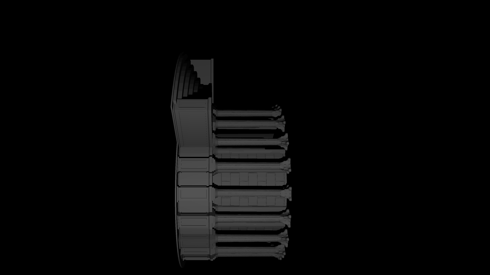

# Ну, пока так

<h2> <a href = "models/0/" > Просто фигурки: </a> </h2>

<table>
<tr>
<td>

</td>
<tr>
<table>

<h2>
    <a href = "http://www.thingiverse.com/thing:319413" >
        Какая-то моделька из интернета:
    </a>
</h2>

<table>
<tr>
<td>

</td>
<td>

</td>
</tr>
<tr>
<td>

</td>
<td>

</td>
</tr>
<tr>
<td>

</td>
<td>

</td>
</tr>
</table>

<h2>
    <a href = "http://www.thingiverse.com/thing:937556" >
        Какая-то беседка из интернета:
    </a>
</h2>
<table>
<tr>
<td>

</td>
</tr>
<tr>
<td>

</td>
</tr>
</table>
